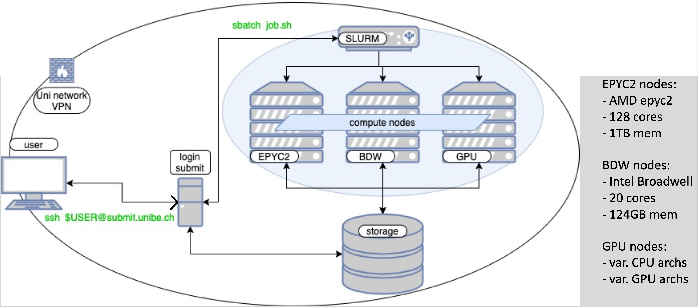

# Guide to Connecting to UBELIX and Starting JupyterLab

We'll be working on UBELIX, the University of Bern's high-performance cluster (HPC), during the NLP CAS. To ensure a smooth process, please have Secure Shell (SSH) installed/activated on your laptop.

[Detailed Information and Guides to UBELIX](https://hpc-unibe-ch.github.io/)

## Prerequisites

### SSH Installation Guides:
- **Windows:** [Install and configure MobaXterm](https://medium.com/@getstaked/how-to-connect-to-your-vps-via-ssh-by-using-mobaxterm-f403c6d3727b)
- **macOS:** [How to SSH on Mac](https://www.servermania.com/kb/articles/ssh-mac)
- **Linux (Ubuntu):** [Enable SSH on Ubuntu](https://linuxize.com/post/how-to-enable-ssh-on-ubuntu-20-04/) (Use Google for other distros)

Ensure you have your campus account (e.g., ab24c123), university email address, and password ready.

In order to connect to UBELIX, you either have to be connected to the Eduroam WiFi or connected via the [UniBE VPN](https://vpn.unibe.ch). Make sure to download, install and configure the VPN!

|

## UBELIX Overview

|

UBELIX is a powerful resource featuring:

- around 320 compute nodes
- ~12k CPU cores
- 160 GPUs with nearly a million GPU cores.

|

It is available to University personnel and students for scientific work and course-related projects. UBELIX allows for extensive software use, with users also able to install their own software within their home directories.

## Why UBELIX?

| Resource            | Pros                                                      | Cons                                                     |
|---------------------|-----------------------------------------------------------|----------------------------------------------------------|
| Private Computer        | High privacy, Full control                                 | May be too slow, Limited capability for large models      |
| Google Colab        | Decent performance, Free tier, Easy to use                 | Limited session time, No privacy, Requires internet connection |
| UBELIX (Unibe HPC)  | Strong performance, Strong privacy, Access to HPC resources | Complex setup, Requires institutional access, Finicky interface |

## Connecting to UBELIX

To connect to UBELIX, you need to log in to a login node from the university network or via VPN from a remote location. Use SSH to log in:

`ssh <user>@submit03.unibe.ch  # Replace <user> with your campus username`

After logging in, you'll find yourself in your home directory (`/storage/homefs/$USER`), where `$USER` is your campus account username. This is where you store your personal files and configurations.

You can check your current working directory at any time using:

`pwd`

## Running JupyterLab on UBELIX

Starting JupyterLab on UBELIX usually requires just three commands:

1. **Login to UBELIX:**
    `ssh -L 15051:localhost:15051 <user>@submit03.unibe.ch  # Replace <user> with your campus username`
    
    _Note: Change the port number to a random value between 2000 and 65000._

2. **Load Anaconda:**
    `module load Anaconda3`

3. **Launch JupyterLab:**
    `jupyter-compute 15051 --time=00:45:00  # Replace 15051 with your chosen port number`

You can add more parameters to request additional resources for the Jupyter environment. Once launched, Jupyter can be accessed from your browser.

### Alternative: New Jupyter Interface

There is a new interface in closed beta testing: [UBELIX OnDemand](https://ondemand.hpc.unibe.ch/). It simplifies launching a Jupyter Notebook but has limited power and some bugs.

Keep your home directory clean by regularly deleting old data or moving data to private storage.
